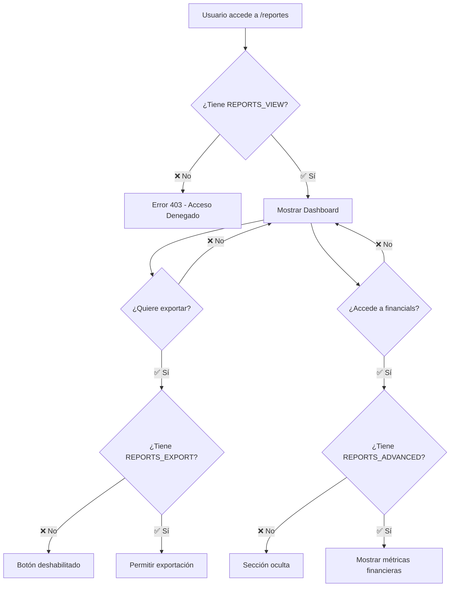

# 📊 **Sistema de Permisos**

## 🎯 **Permisos Implementados**

### **Módulo: REPORTS**

| Permiso | Descripción | Funcionalidades |
|---------|-------------|-----------------|
| `REPORTS_VIEW` | **Visualización básica** | • Ver dashboard principal<br>• Acceder a métricas básicas<br>• Ver gráficos de ocupación<br>• Ver métricas de rutinas |
| `REPORTS_EXPORT` | **Exportación de datos** | • Descargar reportes en Excel<br>• Exportar datos filtrados<br>• Generar archivos personalizados |
| `REPORTS_ADVANCED` | **Analytics avanzados** | • Ver métricas financieras<br>• Acceder a proyecciones<br>• Ver datos de ingresos detallados |

### **Módulo: SCREEN**

| Permiso | Descripción | Funcionalidades |
|---------|-------------|-----------------|
| `SCREEN_VIEW` | **Visualización de pantallas** | • Ver pantallas de rutinas<br>• Acceder a modo pantalla completa<br>• Ver contenido público de rutinas |
| `SCREEN_MANAGE` | **Gestión de pantallas** | • Configurar pantallas<br>• Administrar contenido mostrado<br>• Gestionar rutinas en pantallas |

## 👥 **Configuración Recomendada por Rol**

### **🔴 SuperAdmin**
```typescript
permissions: [
  Permission.REPORTS_VIEW,
  Permission.REPORTS_EXPORT, 
  Permission.REPORTS_ADVANCED,
  Permission.SCREEN_VIEW,
  Permission.SCREEN_MANAGE
]
```
- ✅ **Acceso completo** a todos los reportes
- ✅ **Visualización** de métricas financieras
- ✅ **Exportación** sin restricciones
- ✅ **Gestión completa** de pantallas

### **🟡 Admin (Dueño de Gimnasio)**
```typescript
permissions: [
  Permission.REPORTS_VIEW,
  Permission.REPORTS_EXPORT,
  Permission.SCREEN_VIEW,
  Permission.SCREEN_MANAGE
]
```
- ✅ **Dashboard completo** de su organización
- ✅ **Exportación** de reportes operacionales
- ✅ **Gestión de pantallas** para su gimnasio
- ❌ **Sin acceso** a métricas financieras avanzadas

### **🟢 Manager/Staff**
```typescript
permissions: [
  Permission.REPORTS_VIEW,
  Permission.SCREEN_VIEW
]
```
- ✅ **Visualización básica** de ocupación
- ✅ **Métricas operacionales** (horarios pico, rutinas)
- ✅ **Visualización de pantallas** de rutinas
- ❌ **Sin exportación** ni datos financieros
- ❌ **Sin gestión** de pantallas

### **🔵 Cliente**
```typescript
permissions: []
```
- ❌ **Sin acceso** a reportes administrativos
- ⚡ **Solo sus datos personales** (implementar en futuro)

## 🛠 **Cómo Configurar**

### **1. Asignar Permisos a Usuario**
```typescript
// En el backend, al crear/actualizar usuario
const adminPermissions = [
  Permission.REPORTS_VIEW,
  Permission.REPORTS_EXPORT,
  // ... otros permisos
];

await userService.updatePermissions(userId, adminPermissions);
```

### **2. Verificar en Frontend**
```html
<!-- Botón visible solo con permiso específico -->
<button 
  [appHasPermission]="Permission.REPORTS_EXPORT" 
  [appHasPermissionModule]="Module.REPORTS">
  Exportar
</button>
```

### **3. Validar en Backend**
```typescript
@RequirePermissions(Module.REPORTS, [Permission.REPORTS_VIEW])
async getDashboardMetrics() {
  // Lógica del endpoint
}
```

## 🔄 **Flujo de Permisos**



## ⚙️ **Configuración por Defecto**

### **Al crear nueva organización:**
```typescript
const defaultAdminPermissions = {
  [Module.REPORTS]: [
    Permission.REPORTS_VIEW,
    Permission.REPORTS_EXPORT
  ]
  // ... otros módulos
};
```

### **Para SuperAdmin:**
```typescript
const superAdminPermissions = {
  [Module.REPORTS]: [
    Permission.REPORTS_VIEW,
    Permission.REPORTS_EXPORT,
    Permission.REPORTS_ADVANCED
  ]
  // ... todos los módulos
};
```

## 🎛 **Personalización Avanzada**

### **Reportes por Organización**
- Cada organización puede tener **límites específicos**
- **Métricas personalizadas** según plan de suscripción
- **Filtros automáticos** por contexto de usuario

### **Auditoria de Acceso**
```typescript
// Logging automático de accesos
@AuditLog('reports_access')
async getDashboardMetrics() {
  // Se registra quién accedió y cuándo
}
```

## 🚀 **Próximas Mejoras**

1. **Permisos temporales**: Acceso por tiempo limitado
2. **Reportes personalizados**: Cada usuario crea sus vistas
3. **Notificaciones**: Alertas por cambios en métricas
4. **API de terceros**: Integración con herramientas BI

---

✅ **Sistema implementado y funcionando**
🔐 **Seguridad robusta con permisos granulares**
📈 **Escalable para futuras funcionalidades** 